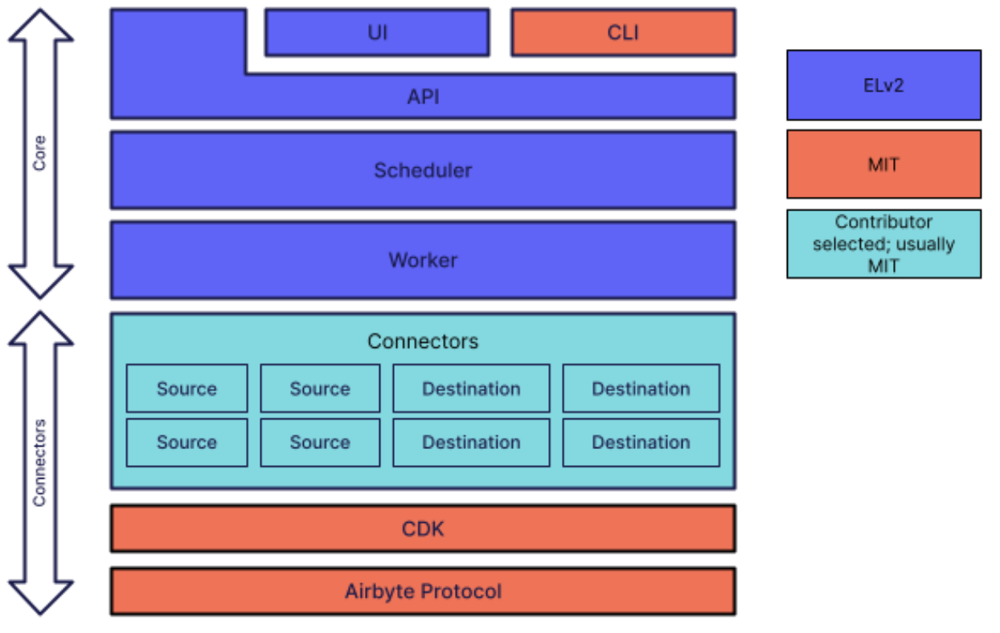

# 免费增值的商业模式

近年来的“开源商业化”风潮当中，风口浪尖的企业 [MongoDB Inc.](https://www.mongodb.com/) 和 [Elastic](https://www.elastic.co/) 都选择了免费增值的商业模式。

虽然它们一开始以某种“开源商业化”的形式出现，商业产品早期是直接提供当时还是开源软件的 [MongoDB](https://github.com/mongodb/mongo) 和 [ElasticSearch](https://github.com/elastic/elasticsearch) 本身，但是随后由于源代码免费可得，包括 AWS 在内的云厂商直接利用免费的源代码在平台上提供同类的服务，这样的新形势使得这两家公司前后把软件协议改成 [Server Side Public License (SSPLv1)](https://www.mongodb.com/licensing/server-side-public-license) 和 [Elastic License (ELv2)](https://www.elastic.co/licensing/elastic-license) 来对抗商业竞争。从这个时候开始，它们就不算是开源软件了。但是从“开放源代码”的角度看，这类软件的源代码确实可以公开获得，而且业内普遍将它们与开源软件关联起来，所以我们也作为“开源与商业”的一类来讨论。再次强调，这些软件是源代码可得的专有软件，并非符合[开源定义（OSD）](https://opensource.org/osd-annotated)的开源软件。

ELv2 是明确的专有软件协议，禁止其他人提供同类的服务，也不允许破解付费密钥锁定的高级功能；SSPLv1 是对 GPL 系列许可的发展，但是要求与 MongoDB 一同构成服务的所有软件都需要按照 SSPLv1 协议发布，即包括开放源代码，这一点超出了 OSI 推出的[开源定义](https://opensource.org/osd)第九条“协议不应该限制其他软件”的原则。实际执行过程中值得注意的是，MongoDB Inc. 采用 SSPLv1 的动机是对抗商业竞争，它同时鼓励用户购买企业提供的以专有软件协议发布的 MongoDB 以避免 SSPLv1 的要求。这种行为的动机与自由软件基金会制造自由软件纯粹是为了让所有人能够自由地使用高质量的软件的初衷非常不同。因此，我并不将这样重新许可后的软件认为是开源软件，而是源码公开的专有软件。关于不同开源协议的讨论，我在[《选择开源许可证》](https://mp.weixin.qq.com/s/6a5MsWcTn9PUAT4WJPhVcg)一文里有详细地展开。

无独有偶，曾经试图通过销售开源软件的公司，最终都走上了重新许可成源码公开的专有软件的路。

* [Why are we changing the license for MongoDB?](https://www.mongodb.com/licensing/server-side-public-license/faq)
* [Upcoming licensing changes to Elasticsearch and Kibana](https://www.elastic.co/blog/licensing-change)
* [Why We're Relicensing CockroachDB](https://www.cockroachlabs.com/blog/oss-relicensing-cockroachdb/)
* [A New License to Future Proof the Commoditization of Data Integration](https://airbyte.com/blog/a-new-license-to-future-proof-the-commoditization-of-data-integration)

另一方面，越来越多的技术创业公司难以抵挡“开放源代码”的潮流和用户与开发者心理预期的转变，又清晰地理解了自己的商业模式就是销售将要开放源代码的这个软件本身，因此它们一开始就选择了源码公开的专有软件协议来禁止其他厂商直接利用公开的源代码销售同类服务开展竞争。

* [Business Source License 1.1](https://mariadb.com/bsl11/)
* [MariaDB Projects using BSL 1.1](https://mariadb.com/projects-using-bsl-11/)
* [Materialize is licensed under the Business Source License agreement](https://github.com/MaterializeInc/materialize/blob/main/LICENSE)

这种商业模式，本质上是 MongoDB Inc. 前任 CEO 所宣称的“免费增值”策略，即在不产生商业竞争的情况下，或者说对于用户，可以免费地使用该软件。等到用户深度参与之后，产生运维支持的需求，或者定制开发尤其是商业软件集成的需求，再转向唯一的供应商 MongoDB Inc. 付费获得支持。

我认为这种模式是说得通的，是一个好的市场营销手段。但是它与自由软件运动和开源运动的理念都是相违背的。

自由软件运动的理念是所有软件都应该能够被所有人自由地用于所有用途，显然用于提供托管服务就是其中一种用途，而上述软件协议不允许任何形式地提供同类托管服务。另一方面，自由软件运动的起源之一是 [Richard Stallman](https://stallman.org/) 在打印机软件出现故障时无法取得源代码修复并重新编译和使用的痛苦。ElasticSearch 以付费密钥锁定的功能，是不是用户也需要的功能呢？如果我开发了同样的功能并且发布了，这里是否会产生破解的嫌疑呢？

开源定义下的开源运动也包括了不限制用途和不限制其他软件的要求。进一步的，以 Apache 软件基金会为代表的开源世界，努力生产开源软件的基础是为了让所有潜在的参与者和用户平等地使用开源软件和参与开发。上述源码公开的专有软件，几乎只有相应商业公司的成员才能开发核心代码，并且解决的需求也是其客户提交的需求，随后进行商业交付。如前所述，如果有一个开发者完成了商业公司提供的付费功能并且期望合并到上游发布，上游会接受吗？

不过，抛开以专有协议许可的核心部分不谈，这些企业共同选择了在生态连接所需要的接口和模块方面，采用宽容的开源协议例如 Apache 2.0 或者 MIT 来许可。尤其是 Airbyte 提出的核心以 ELv2 许可的软件及其相应协议的模型，对于 CLI 和 Connector 等部分，都是开源软件。

如果把源码公开的专有协议部分视作商业软件而非传统意义上的开源软件，那么这种形式与接下来要讨论的依托于开源软件的商业模型就有很大的相似性了。只不过，当下的市场没能很好地区分开开源软件和源码可得的专有软件。如果一个企业的商业模型就是销售“开源”软件本身的功能，例如前面提到的 MongoDB Inc. 和 Elastic 还有 CockroachLabs 这样的，那么他们的核心功能转向专有软件只不过是时间问题，或者说只要面临商业竞争，就是经不起挑战的。

对于这样的企业来说，它的核心软件只能依靠自己开发，是不可能大范围地借助开源协同的力量完善和覆盖尽可能多的场景的。而且由于商业上的排他性，其他得到资本支持的研发团队也很难直接参与到开发中来。这样的软件与过去的专有软件，都会在开源吞噬软件的浪潮下最终被取代。关于开源吞噬软件在工程上的论证，[《大教堂与集市》](https://book.douban.com/subject/25881855/)一书当中的 2.12 节《管理与马奇诺防线》有详细地论证。

这类商业模型的企业制造的软件生态当中可能出现的协同，也局限于用户在没有其他开源软件选择的时候，根据自己的需要和上游以开源软件开发的组件的情况，相应的做一些补充。例如 Airbyte 支持其他数据源的导入，例如 GitHub 其实是个专有软件，但是在 [toolkit](https://github.com/octokit/) 和 [actions runner](https://github.com/actions/) 以及 [gh cli](https://github.com/cli) 等方面公开了相应的开源组件，这些组件也能得到开源社群的助力。
